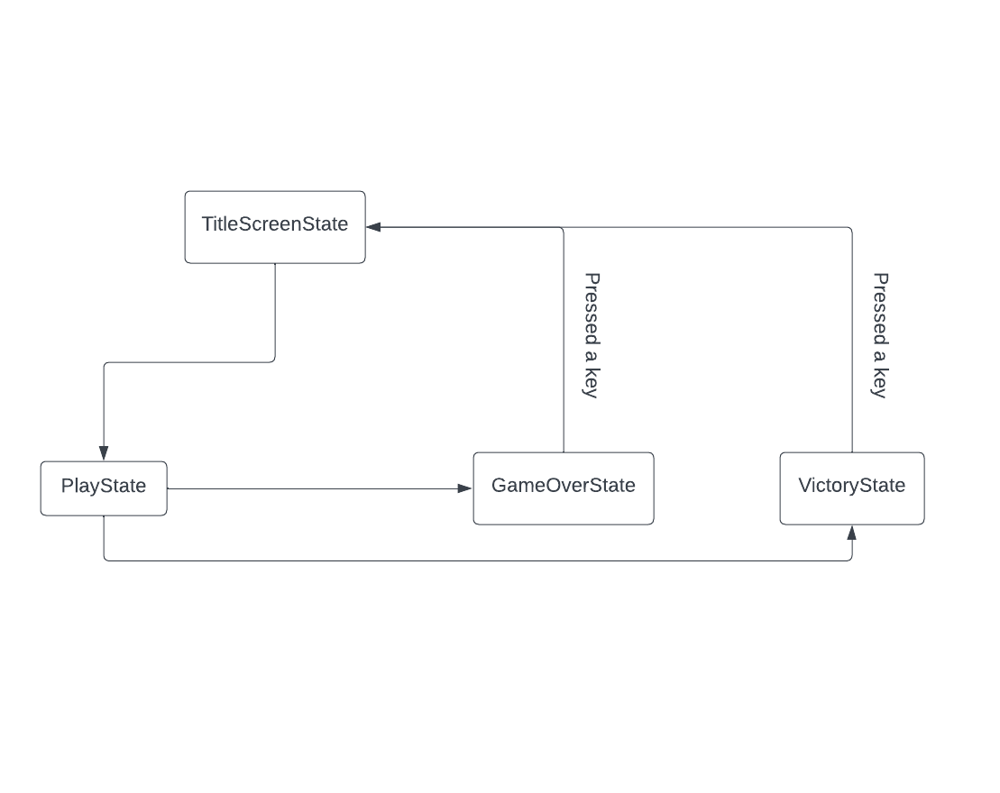
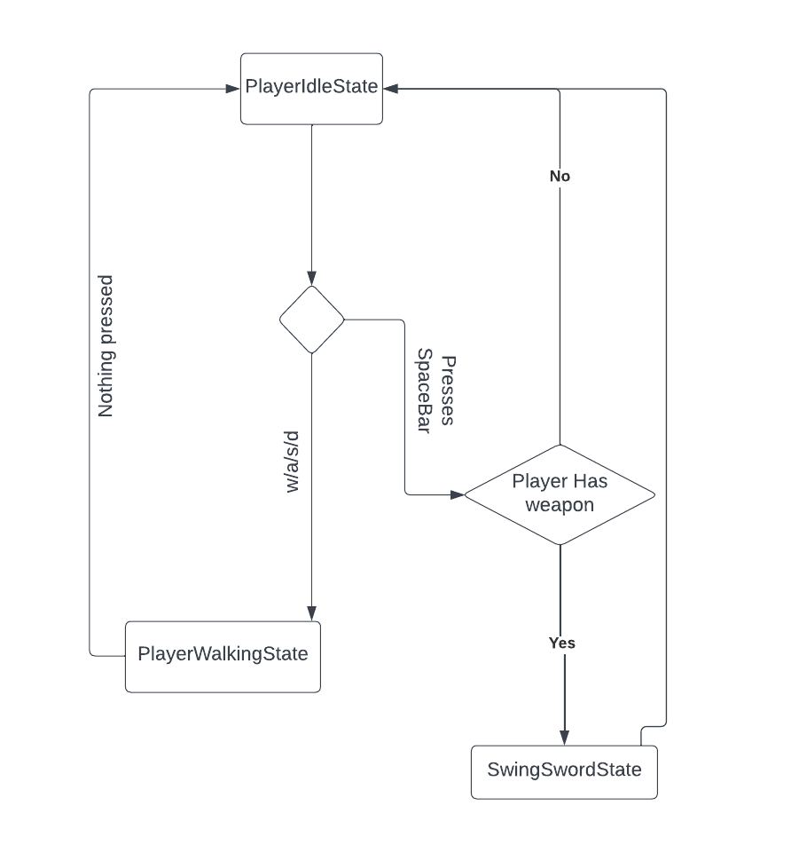
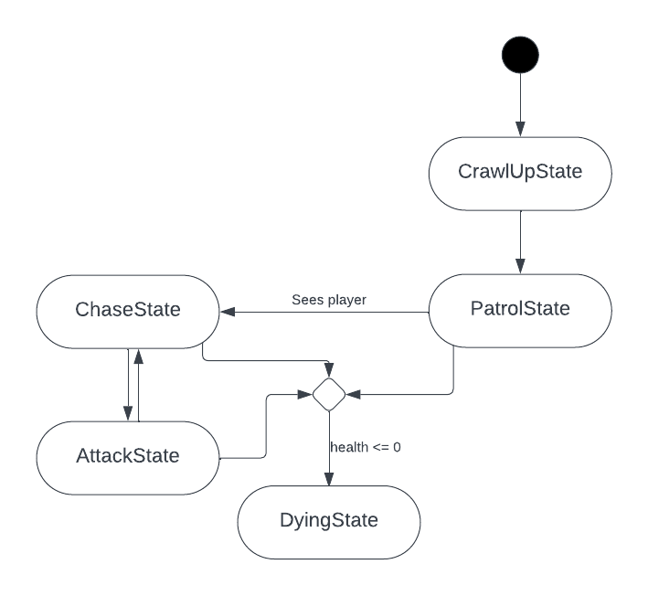
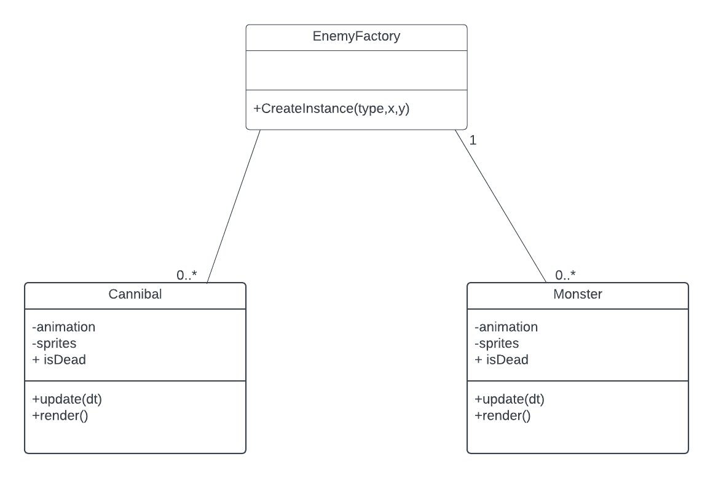
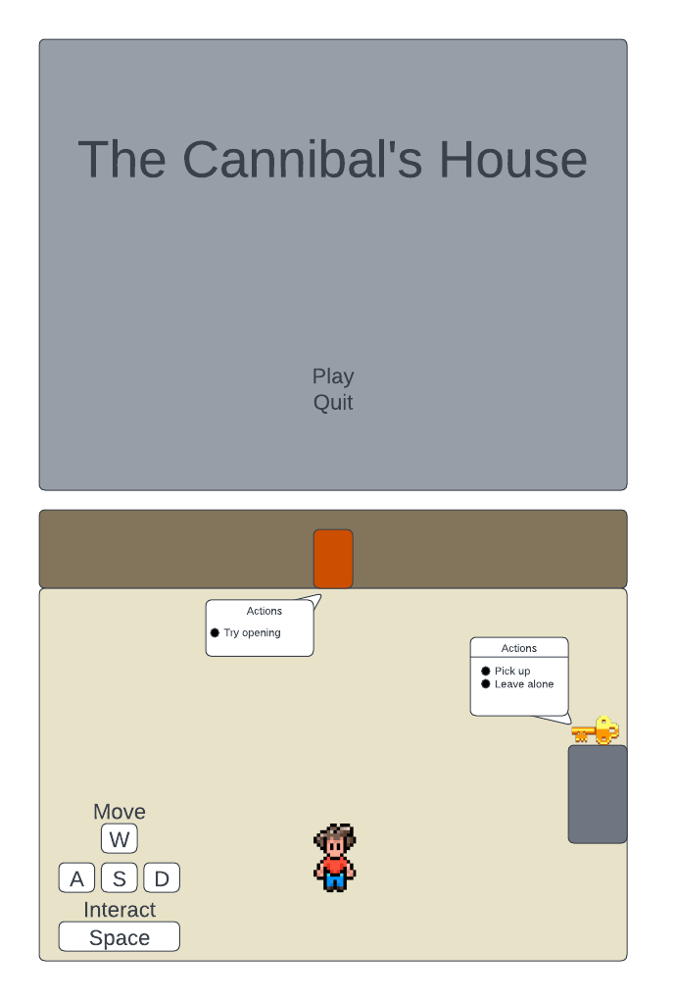

# The Cannibal's House Public

## Context
This project was created by me and a former colleague of mine who graduated from John Abbott College. This was done for our Game Programming Project. 
With the knowledge given by the teacher of the concepts of Game Development and proper coding practice, we are both greateful to have reached this
stage of not only our coding knowledge in JavaScript handling back end logic but also how to organize code, what architecture patterns we should use
to create sprites, how we should access an image and/or audio file, how to make the game more dynamic, how to implement animation etc....

# Our Game
## ✒️Game Description

In this scary game, the player must find his way out of the cannibal's house. In order to do so,
the player must go search in multiple rooms to find the keys that unlocks a door. If the player is
subject to a monster attack, he will lose a few lives. Once the player has got all the keys, 
he will enter the final room where the cannibal is located. The final room is the only way to get
out of the house. The player must consequently fight the cannibal until he successfully takes the cannibal
down to the ground.

## 🕹️ Gameplay

The player starts in a small room with a door and a key, so the player can get used to the controls for moving around, interacting with objects,
and accessing the inventory system. The player will then enter a hub room with several doors, each which lead to their own room with a puzzle.
Upon completing each puzzle, they acquire a key which gives them access to the next door, all the way up until the final door, where the confrontation
with the cannibal takes place. The player will undergo jarring noises in a certain room, warning the player that may be a monster in the room.
Based on RNG, a monster will crawl out of the ground and chase the player if he is spotted.
If the player is lucky, the room will be quiet as a mouse, assuring the player that he's safe inside. If the player inflicts
damage, he can search for bandages in drawers that will partially heal the player. If need be, the player can search for weapons for self-defense

## 📃 Requirements

1. Player shall be able to move in certain rooms
2. Player shall be able to take and claim a key
3. Player must avoid monsters or even the cannibal.
4. Player shall be able to access another room when he claimed a key
5. Player shall inflict damage if he gets attacked by a monster.
6. Player shall die if the player 
   has no health left.
7. Player shall partially heal if user collected a heart. 
8. Player shall be able to damage the monster if the player has a weapon in 
   in his collection bag.
9. When player wins, the game shall bring the user to the victory page and show what they achieved so far.
10. When player loses, the game shall bring the user the "Game Over" page and then wait for the player to press a
    key to redirect him/her to the main page.
11. Every time the player reach an area in a particular room, a message box shall be shown.
12. When the player swings a sword to the enemy, the enemy must inflict damage.

## State Diagram

### 🗺️ Class Diagram

## 🧵 Wireframe

### 🎨 Assets

 - We used [Lucid Charts](https://lucid.co) to create our wireframes. 

Our wireframe describes a sample layout of one of our maps and the actions 
that will happen in a particular room. 

#### 🖼️ Images

- We took all the images from [Imgur](https://imgur.com/gallery/mTiIgbq).

#### 🔊 Sounds

Our sounds were taken from:

- [Zapsplat](https://www.zapsplat.com)
- [Free Sound](https://freesound.org)
